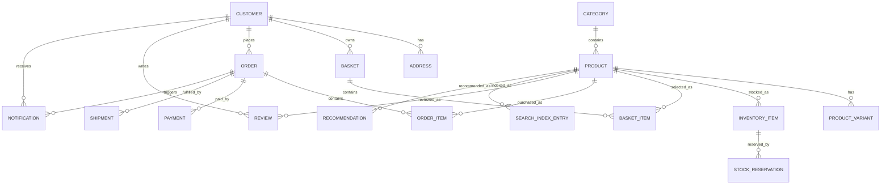

# Domain Model

## 1. Purpose

This document defines the high-level domain model for **bfstore**, ACME Ltd’s fictional online furniture store backend.

The domain model describes the core business concepts, how they relate to one another, which services own them, and how those concepts support the main customer journeys.

This document is intended to help potential clients, reviewers, and engineers understand the business structure of the system before looking at API contracts, database schemas, or implementation details.

---

## 2. Scope

This document covers the conceptual domain model for the bfstore backend.

It includes:

- core business entities
- service ownership of domain concepts
- relationships between concepts
- domain lifecycle states
- key business rules
- data ownership boundaries
- event implications
- modelling trade-offs

This document does **not** define physical database tables. Database design is covered separately in:

```text
docs/data/service-database-design.md
docs/data/data-ownership.md
docs/data/mysql-standards.md
```

> [!IMPORTANT]
> The domain model should guide database design, but it should not be treated as a one-to-one table design.

---

## 3. Domain Modelling Principles

bfstore follows these domain modelling principles.

### 3.1 Model Business Concepts First

The domain model should describe ACME Ltd’s business concepts before implementation details.

For example:

```
Product
Basket
Order
Payment
Shipment
Stock Reservation
Review
```

These are business concepts.

Implementation details such as tables, indexes, queues, structs, and RPC handlers come later.

---

### 3.2 Service Ownership Must Be Clear

Every important domain concept should have a clear owning service.

For example:

| Domain Concept    | Owning Service      |
| ----------------- | ------------------- |
| Product           | `catalog-service`   |
| Stock Reservation | `inventory-service` |
| Basket            | `basket-service`    |
| Order             | `order-service`     |
| Payment           | `payment-service`   |
| Shipment          | `shipping-service`  |

Other services may hold local copies or projections, but they are not the source of truth.

---

### 3.3 Avoid Shared Database Thinking

Services must not share one database model.

Each service owns its own data store and exposes behaviour through:

```
gRPC APIs
Kafka events
protobuf contracts
```

The domain model defines conceptual ownership. It does not permit direct cross-service database access.

---

### 3.4 Distinguish Source-of-Truth Data from Projections

Some services may keep local read models or indexes.

For example:

```
search-service may store product search documents.
recommendation-service may store recommendation inputs or calculated suggestions.
notification-service may store notification delivery status.
```

These are not the source of truth for product, order, or customer data.

---

### 3.5 Accept Eventual Consistency Where Appropriate

Some parts of the system do not need immediate consistency.

Examples:

```
search index updates after product changes
recommendations after order events
review rating summaries
notification delivery after order creation
```

The checkout flow needs stronger coordination than search, recommendations, and notifications.

---

## 4. Core Domain Areas

bfstore is split into the following core domain areas:

| Domain Area         | Description                                                  | Primary Service          |
| ------------------- | ------------------------------------------------------------ | ------------------------ |
| Identity and Access | Authentication, authorisation, user sessions                 | `auth-service`           |
| Customer            | Customer profiles, addresses, preferences                    | `customer-service`       |
| Catalogue           | Products, categories, furniture attributes, pricing          | `catalog-service`        |
| Inventory           | Stock levels, warehouses, reservations                       | `inventory-service`      |
| Basket              | Customer shopping baskets and basket items                   | `basket-service`         |
| Order               | Order creation, order items, order lifecycle                 | `order-service`          |
| Payment             | Payment attempts, authorisations, captures, refunds          | `payment-service`        |
| Shipping            | Delivery options, shipments, fulfilment status               | `shipping-service`       |
| Notification        | Customer-facing messages and delivery status                 | `notification-service`   |
| Review              | Product reviews, ratings, moderation                         | `review-service`         |
| Search              | Product search index and query model                         | `search-service`         |
| Recommendation      | Related products, popular products, personalised suggestions | `recommendation-service` |

---

## 5. High-Level Domain Model

```
Customer
    ├── CustomerProfile
    ├── Address
    ├── Basket
    │     └── BasketItem
    ├── Order
    │     ├── OrderItem
    │     ├── Payment
    │     └── Shipment
    └── Review

Product
    ├── Category
    ├── ProductAttribute
    ├── ProductImage
    ├── ProductVariant
    ├── InventoryItem
    ├── BasketItem
    ├── OrderItem
    ├── Review
    ├── SearchIndexEntry
    └── Recommendation

InventoryItem
    └── StockReservation

Order
    ├── StockReservation
    ├── Payment
    ├── Shipment
    └── Notification
```

This diagram is conceptual. It shows business relationships, not database ownership.

For example, ```OrderItem``` references product information, but the ```order-service``` does not own the full ```Product ```entity. 
It may store a snapshot of product name, price, and quantity at the time of order.

---

## 6. Domain Concepts

### 6.1 Customer

A Customer is a person who uses the ACME online furniture store.

Customers may browse products anonymously, but protected actions such as viewing order history, managing addresses, submitting reviews, or cancelling orders require authentication.

Owning Service

```customer-service```

Related Services

| Service                | Relationship                                        |
| ---------------------- | --------------------------------------------------- |
| `auth-service`         | Provides identity and authentication context        |
| `basket-service`       | Associates baskets with customers or guest sessions |
| `order-service`        | Associates orders with customers                    |
| `notification-service` | Sends customer notifications                        |
| `review-service`       | Associates reviews with customers                   |


Key Attributes
```
customer_id
email
first_name
last_name
phone_number
default_address_id
preferences
created_at
updated_at
status
```

Customer Statuses

```
active
disabled
deleted
```

Notes

Customer data may contain personally identifiable information. It must be handled carefully and must not be logged unnecessarily.

---

### 6.2 Customer Profile

A Customer Profile contains customer-facing account details and preferences.

Owning Service

```customer-service```

Key Attributes
```
customer_id
display_name
contact_preferences
marketing_preferences
default_delivery_address
created_at
updated_at
```

Notes

The initial version may keep customer profile functionality minimal. Full profile management can be added after the checkout vertical slice is working.


---

### 6.3 Address

An Address represents a customer delivery address.

Owning Service

```customer-service```

Used By

| Service                | Usage                                                   |
| ---------------------- | ------------------------------------------------------- |
| `order-service`        | May reference delivery address snapshot during checkout |
| `shipping-service`     | Uses delivery address to create shipment                |
| `notification-service` | May include delivery summary in notifications           |

Key Attributes

```
address_id
customer_id
line_1
line_2
town_or_city
county
postcode
country
is_default
created_at
updated_at
```

Business Rules

A customer may have multiple addresses.
A customer may have one default delivery address.
Checkout requires a valid delivery address.
Orders should store an address snapshot so historical orders remain accurate if the customer later changes their address.

---

### 6.4 Product

A Product represents a furniture item sold by ACME Ltd.

Examples:
```
sofa
dining table
wardrobe
bed frame
office chair
coffee table
Owning Service
catalog-service
```
Related Services

| Service                  | Relationship                            |
| ------------------------ | --------------------------------------- |
| `inventory-service`      | Tracks stock for products               |
| `basket-service`         | References products in basket items     |
| `order-service`          | Stores product snapshots in order items |
| `search-service`         | Indexes products for search             |
| `review-service`         | Associates reviews with products        |
| `recommendation-service` | Uses products for recommendations       |

Key Attributes
```
product_id
name
description
category_id
price
currency
material
colour
dimensions
weight
care_instructions
status
created_at
updated_at
```
Product Statuses
```
draft
active
inactive
discontinued
```
Business Rules

Only active products should be visible to customers.
Inactive products cannot be added to baskets.
Discontinued products should not be purchasable.
Product information should be published as events when it changes so downstream services can update projections.

Events

Potential events:

```
ProductCreated
ProductUpdated
ProductActivated
ProductDeactivated
ProductDiscontinued
```
---

### 6.5 Category

A Category groups products into customer-facing furniture groups.

Examples:
```
sofas
beds
wardrobes
tables
chairs
storage
office furniture
garden furniture
Owning Service
catalog-service
```

Key Attributes
```
category_id
name
slug
description
parent_category_id
status
display_order
```

Business Rules

A product should belong to at least one category.
Categories may be hierarchical.
Inactive categories should not appear in customer-facing navigation.

---

### 6.6 Product Variant

A Product Variant represents a purchasable variation of a product.

Examples:

```
same sofa in different colours
same table in different sizes
same bed frame in king or double size
```

Owning Service

```catalog-service```

Key Attributes
```
variant_id
product_id
sku
colour
size
material
price
currency
dimensions
status
```

Notes

For the first version, variants may be simplified. If each product has only one purchasable form, the model can start with Product only and introduce variants later.


---

### 6.7 Inventory Item

An Inventory Item represents stock held for a product or product variant.

Owning Service

```inventory-service```

Related Services

| Service                  | Relationship                          |
| ------------------------ | ------------------------------------- |
| `catalog-service`        | Product source of truth               |
| `order-service`          | Requests reservations during checkout |
| `search-service`         | May consume availability updates      |
| `recommendation-service` | May use availability data             |


Key Attributes

```
inventory_item_id
product_id
variant_id
warehouse_id
available_quantity
reserved_quantity
status
updated_at
```

Business Rules

Inventory Service owns stock levels.
Other services must not modify stock directly.
Stock must not be reserved below zero.
Stock availability may be exposed through gRPC and events.

Events

Potential events:

```
InventoryAdjusted
StockReserved
StockReservationFailed
StockReservationReleased
StockReservationExpired
```

---

### 6.8 Warehouse

A Warehouse represents a location from which furniture stock may be fulfilled.

Owning Service

```inventory-service```

Key Attributes

```
warehouse_id
name
location
status
```

Notes

The initial version may model a single warehouse. Multi-warehouse fulfilment can be added later.

---

### 6.9 Stock Reservation

A Stock Reservation temporarily holds stock for a checkout or order.

Owning Service

```inventory-service```

Created By

```order-service requests reservation from inventory-service```

Key Attributes

```
reservation_id
product_id
variant_id
quantity
order_id
basket_id
status
expires_at
created_at
updated_at
```

Reservation Statuses
```
pending
reserved
released
expired
committed
failed
```

Business Rules

A reservation must be linked to a checkout or order context.
A reservation should expire if checkout does not complete.
Payment failure should release or eventually expire the reservation.
Successful order confirmation may commit the reservation.
Reservation operations should be idempotent where possible.

Events

```
StockReserved
StockReservationFailed
StockReservationReleased
StockReservationExpired
StockCommitted
```

---

### 6.10 Basket

A Basket represents a customer’s current shopping basket.

Owning Service

```basket-service```

Related Services

| Service                  | Relationship                          |
| ------------------------ | ------------------------------------- |
| `catalog-service`        | Validates products and product status |
| `inventory-service`      | May check availability                |
| `order-service`          | Uses basket contents during checkout  |
| `recommendation-service` | May consume basket events             |


Key Attributes
```
basket_id
customer_id
guest_session_id
status
created_at
updated_at
expires_at
```

Basket Statuses
```
active
checked_out
abandoned
expired
cleared
```
Business Rules

A basket may belong to a registered customer or guest session.
A basket must contain at least one item before checkout.
Basket updates do not reserve stock.
Basket should be cleared or marked checked out after successful order creation.
Basket should not directly own product catalogue data.

Events

Potential events:
```
BasketCreated
BasketItemAdded
BasketItemUpdated
BasketItemRemoved
BasketCheckedOut
BasketAbandoned
```

--- 

### 6.11 Basket Item

A Basket Item represents a selected product and quantity in a basket.

Owning Service

```basket-service```

Key Attributes

```
basket_item_id
basket_id
product_id
variant_id
quantity
price_snapshot
currency
added_at
updated_at
```

Business Rules

Quantity must be greater than zero.
Setting quantity to zero removes the item.
Inactive products cannot be added.
Basket item price may be a snapshot or recalculated at checkout depending on final pricing decision.
The basket does not guarantee stock availability until checkout.

---

### 6.12 Order

An Order represents a confirmed or attempted purchase.

Owning Service
```order-service```

Related Services

| Service                | Relationship                                               |
| ---------------------- | ---------------------------------------------------------- |
| `basket-service`       | Provides basket contents                                   |
| `inventory-service`    | Reserves stock                                             |
| `payment-service`      | Authorises and records payment                             |
| `shipping-service`     | Creates shipment                                           |
| `notification-service` | Sends order notifications                                  |
| `customer-service`     | Provides customer context                                  |
| `catalog-service`      | Product source of truth, indirectly used through snapshots |

Key Attributes
```
order_id
customer_id
basket_id
order_number
status
total_amount
currency
delivery_address_snapshot
created_at
updated_at
confirmed_at
cancelled_at
```

Order Statuses
```
pending
stock_reserved
payment_authorised
confirmed
shipment_created
cancelled
failed
refunded
fulfilled
```

Business Rules

An order cannot be confirmed unless stock is reserved.
An order cannot be confirmed unless payment is authorised.
Order items should store product and price snapshots.
Order creation should be idempotent.
Customers must not be able to view another customer’s orders.
Failed checkout should not create a confirmed order.
Order lifecycle transitions should be explicit and auditable.

Events

```
OrderCreated
OrderConfirmed
OrderFailed
OrderCancelled
OrderFulfilled
OrderRefunded
```

---

### 6.13 Order Item

An Order Item represents a purchased product within an order.

Owning Service
```order-service```

Key Attributes
```
order_item_id
order_id
product_id
variant_id
product_name_snapshot
sku_snapshot
quantity
unit_price_snapshot
currency
line_total
```

Business Rules

Order items should retain product information from the time of purchase.
Later catalogue changes should not rewrite historical order items.
Order item totals should match the order total calculation.

---

### 6.14 Payment

A Payment represents the payment state for an order.

Owning Service
```payment-service```

Related Services

| Service                | Relationship                               |
| ---------------------- | ------------------------------------------ |
| `order-service`        | Requests payment authorisation             |
| `notification-service` | May notify customers of payment status     |
| `customer-service`     | Customer context, but not raw payment data |

Key Attributes

```
payment_id
order_id
customer_id
amount
currency
status
provider_reference
authorised_at
captured_at
failed_at
refunded_at
created_at
updated_at
```

Payment Statuses
```
pending
authorised
declined
captured
failed
refunded
cancelled
```

Business Rules

Raw card data must not be stored.
Sensitive payment data must not be logged.
Payment attempts must be auditable.
Duplicate payment authorisation requests should be handled safely.
Payment authorisation failure must prevent order confirmation.

Events
```
PaymentAuthorised
PaymentFailed
PaymentCaptured
PaymentRefunded
```

---

### 6.15 Payment Attempt

A Payment Attempt records an individual attempt to authorise, capture, or refund a payment.

Owning Service

```payment-service```

Key Attributes
```
payment_attempt_id
payment_id
order_id
attempt_type
status
failure_reason
provider_reference
created_at
```

Business Rules

Each attempt should be recorded.
Failed attempts should not expose sensitive provider details to customers.
Payment attempt logs must be safe for operational review.


---

### 6.16 Shipment

A Shipment represents the fulfilment and delivery of an order.

Owning Service

```shipping-service```

Related Services

| Service                | Relationship                               |
| ---------------------- | ------------------------------------------ |
| `order-service`        | Requests shipment creation                 |
| `notification-service` | Sends shipment updates                     |
| `customer-service`     | Address source, or address snapshot source |
| `inventory-service`    | May provide fulfilment stock context       |

Key Attributes

```
shipment_id
order_id
customer_id
delivery_address_snapshot
delivery_option
tracking_reference
status
created_at
dispatched_at
delivered_at
updated_at
```

Shipment Statuses

```
pending
created
ready_for_dispatch
dispatched
in_transit
delivered
delayed
failed
cancelled
```

Business Rules

A shipment must reference an order.
A shipment must have a valid delivery address.
Live carrier integration is out of scope initially.
Shipment failure after order creation must be visible operationally.

Events
```
ShipmentCreated
ShipmentDispatched
ShipmentDelivered
ShipmentDelayed
ShipmentFailed
ShipmentCancelled
```

---

### 6.17 Notification

A Notification represents a customer-facing message generated from business events.

Owning Service

```notification-service```

Related Services

| Service            | Relationship                                     |
| ------------------ | ------------------------------------------------ |
| `order-service`    | Publishes order events                           |
| `payment-service`  | Publishes payment events                         |
| `shipping-service` | Publishes shipment events                        |
| `customer-service` | Provides customer contact details or preferences |

Key Attributes

```
notification_id
customer_id
event_id
notification_type
channel
recipient
status
failure_reason
created_at
sent_at
updated_at
```

Notification Types

```
order_confirmation
payment_failed
shipment_created
shipment_dispatched
shipment_delivered
order_cancelled
refund_processed
```

Channels
```
email
sms
push
```

The first implementation may simulate sending rather than integrate with real providers.

Notification Statuses
```
pending
sent
failed
retrying
cancelled
```

Business Rules

Notification failure must not roll back order creation.
Notification processing should be idempotent.
Duplicate events should not send duplicate messages where avoidable.
Sensitive data must not be written into notification logs.

Events
```
NotificationRequested
NotificationSent
NotificationFailed
```

---

### 6.18 Review

A Review represents customer feedback for a product.

Owning Service
```review-service```

Related Services

| Service                  | Relationship                                     |
| ------------------------ | ------------------------------------------------ |
| `catalog-service`        | Validates product existence                      |
| `order-service`          | May validate that customer purchased the product |
| `search-service`         | May index rating summaries                       |
| `recommendation-service` | May use reviews as recommendation signals        |

Key Attributes

```
review_id
product_id
customer_id
order_id
rating
title
body
status
created_at
updated_at
moderated_at
```
Review Statuses
```
pending
approved
rejected
hidden
deleted
```

Business Rules

Rating must be within the allowed range.
Reviews may require moderation.
A customer may need to have purchased a product before reviewing it.
Reviews should not contain unsafe or inappropriate content.
Review summaries may be eventually consistent.

Events
```
ReviewCreated
ReviewApproved
ReviewRejected
ReviewDeleted
```

---

### 6.19 Search Index Entry

A Search Index Entry is a local search representation of a product.

Owning Service
```search-service```

Source of Truth

The source of truth for product data remains:

```catalog-service```

The Search Service owns a projection optimised for search.

Key Attributes

```
search_entry_id
product_id
name
description
category
price
currency
material
colour
dimensions
availability
rating_summary
indexed_at
```

Business Rules

Search index entries are derived from events or API-based synchronisation.
Search results may be eventually consistent.
Inactive products should not appear in customer-facing search results.
Search Service must not become the source of truth for catalogue data.

Events Consumed

```
ProductCreated
ProductUpdated
ProductDeactivated
InventoryAdjusted
ReviewApproved
```

Events Published
```
SearchIndexUpdated
SearchIndexUpdateFailed
```

---

###  6.20 Recommendation

A Recommendation represents a suggested product or set of products.

Owning Service
```recommendation-service```

Source Inputs

The Recommendation Service may use events or projections from:

```
catalog-service
basket-service
order-service
review-service
search-service
```

Recommendation Types

```
related_products
popular_products
frequently_bought_together
similar_material
similar_colour
similar_category
personalised
```

Key Attributes

```
recommendation_id
customer_id
product_id
recommended_product_ids
recommendation_type
reason
created_at
expires_at
```

Business Rules

Recommendations must not include inactive products.
Recommendations should degrade gracefully if insufficient data exists.
Initial recommendations may be rules-based rather than machine-learning based.
Recommendation outputs are advisory and should not be treated as source-of-truth product data.

Events Consumed
```
ProductViewed
BasketItemAdded
OrderCreated
ReviewCreated
ProductUpdated
```

Events Published

```RecommendationGenerated```

---

## 7. Service Ownership Summary

| Service                  | Owns                                               | Does Not Own                                                 |
| ------------------------ | -------------------------------------------------- | ------------------------------------------------------------ |
| `auth-service`           | identities, credentials, tokens, sessions, roles   | customer profile, orders, payments                           |
| `customer-service`       | customer profiles, addresses, preferences          | authentication credentials, orders, payments                 |
| `catalog-service`        | products, categories, product attributes, variants | stock, basket, orders, reviews                               |
| `inventory-service`      | stock levels, warehouses, stock reservations       | product descriptions, basket items, payments                 |
| `basket-service`         | baskets, basket items                              | stock reservation, payment, order lifecycle                  |
| `order-service`          | orders, order items, order status                  | product catalogue, stock source of truth, payment processing |
| `payment-service`        | payments, payment attempts, refunds                | order lifecycle, stock, shipments                            |
| `shipping-service`       | shipments, delivery options, tracking state        | order creation, payment, stock                               |
| `notification-service`   | notification requests, delivery status             | order state, customer source of truth                        |
| `review-service`         | product reviews, ratings, moderation state         | product catalogue source of truth                            |
| `search-service`         | search index and query projection                  | product catalogue source of truth                            |
| `recommendation-service` | recommendation rules/projections/results           | product catalogue, orders, payments                          |

---

## 8. Conceptual Relationships

### 8.1 Customer Relationships

```
Customer
    owns CustomerProfile
    owns Address
    may own Basket
    may place Order
    may submit Review
    may receive Notification
```

### 8.2 Product Relationships

```
Product
    belongs to Category
    may have ProductVariant
    has InventoryItem
    may appear in BasketItem
    may appear in OrderItem
    may receive Review
    may appear in SearchIndexEntry
    may appear in Recommendation
```

### 8.3 Checkout Relationships

```
Basket
    contains BasketItem

Order
    created from Basket
    contains OrderItem
    requires StockReservation
    requires Payment
    may require Shipment
    triggers Notification
```

### 8.4 Eventual Consistency Relationships

```
ProductUpdated
    updates SearchIndexEntry later

OrderCreated
    triggers Notification later
    may feed Recommendation later
    may feed Analytics later

ReviewApproved
    updates rating summary later
    may update SearchIndexEntry later
```

---

## 9. Domain Lifecycle Models

### 9.1 Basket Lifecycle

```
active
    -> checked_out
    -> cleared

active
    -> abandoned

active
    -> expired
```

Notes

A basket starts as active.
Successful checkout marks the basket as checked out or clears it.
Inactive baskets may expire.
Basket state does not reserve stock.

---

### 9.2 Stock Reservation Lifecycle

```
pending
    -> reserved
    -> committed

reserved
    -> released

reserved
    -> expired

pending
    -> failed
```

Notes

Reservations protect checkout from overselling.
Reservations should have expiry times.
Payment failure should release or expire reservations.
Successful order confirmation should commit reservations.

---

### 9.3 Order Lifecycle

```
pending
    -> stock_reserved
    -> payment_authorised
    -> confirmed
    -> shipment_created
    -> fulfilled

pending
    -> failed

confirmed
    -> cancelled

confirmed
    -> refunded
```

Notes

The exact lifecycle may be simplified in early implementation. However, state transitions should remain explicit and observable.

---

### 9.4 Payment Lifecycle

```
pending
    -> authorised
    -> captured
    -> refunded

pending
    -> declined

pending
    -> failed

authorised
    -> cancelled
```

Notes

The initial implementation may simulate payment authorisation and treat authorisation as enough for order creation. Capture and refund can be added later.

---

### 9.5 Shipment Lifecycle

```
pending
    -> created
    -> ready_for_dispatch
    -> dispatched
    -> in_transit
    -> delivered

created
    -> cancelled

created
    -> failed

in_transit
    -> delayed
```

Notes

The first version may only implement:
```
created
dispatched
delivered
failed
```

---

### 9.6 Notification Lifecycle

```
pending
    -> sent

pending
    -> retrying
    -> sent

pending
    -> failed
```

Notes

Notification failure must not roll back order creation.

---

### 9.7 Review Lifecycle

```
pending
    -> approved
    -> visible

pending
    -> rejected

approved
    -> hidden

approved
    -> deleted
```

Notes

Review moderation can be simplified or deferred.

---

## 10. Key Business Rules

| ID       | Rule                                                                    | Primary Owner                               |
| -------- | ----------------------------------------------------------------------- | ------------------------------------------- |
| `BR-001` | Only active products can be shown in customer-facing catalogue results. | `catalog-service`                           |
| `BR-002` | Inactive or discontinued products cannot be added to a basket.          | `basket-service`, `catalog-service`         |
| `BR-003` | Basket item quantity must be greater than zero.                         | `basket-service`                            |
| `BR-004` | Basket updates do not reserve stock.                                    | `basket-service`                            |
| `BR-005` | Stock must be reserved before an order is confirmed.                    | `order-service`, `inventory-service`        |
| `BR-006` | Stock cannot be reserved below zero.                                    | `inventory-service`                         |
| `BR-007` | Payment must be authorised before an order is confirmed.                | `order-service`, `payment-service`          |
| `BR-008` | Failed payment must not produce a confirmed order.                      | `order-service`, `payment-service`          |
| `BR-009` | Order items must store product and price snapshots.                     | `order-service`                             |
| `BR-010` | Notification failure must not roll back order creation.                 | `notification-service`, `order-service`     |
| `BR-011` | Customers must not access another customer’s orders.                    | `order-service`, `auth-service`             |
| `BR-012` | Sensitive payment data must not be logged or stored.                    | `payment-service`                           |
| `BR-013` | Search results may be eventually consistent with the product catalogue. | `search-service`                            |
| `BR-014` | Recommendations must not include inactive products.                     | `recommendation-service`, `catalog-service` |
| `BR-015` | A review must be associated with an existing product.                   | `review-service`, `catalog-service`         |

---

## 11. Aggregate and Consistency Boundaries

This section describes important consistency boundaries in the system.

### 11.1 Stronger Consistency Required

The checkout path requires careful coordination.
```
Basket
Stock Reservation
Payment
Order
Shipment
```

The system must prevent:

confirming orders without stock
confirming orders without payment authorisation
duplicate orders from duplicate checkout attempts
stock being reserved indefinitely after payment failure

This does not necessarily require a distributed transaction, but it does require explicit state transitions, idempotency, retries, and compensation.

---

### 1.2 Eventual Consistency Accepted

The following can be eventually consistent:

```
search index
recommendations
review summaries
notification delivery status
analytics projections
availability summaries displayed in catalogue
```

These areas should be observable, retryable, and idempotent.

---

## 12. Source of Truth by Domain Concept

| Concept           | Source of Truth          | Projection / Consumers                                                |
| ----------------- | ------------------------ | --------------------------------------------------------------------- |
| Customer identity | `auth-service`           | API Gateway, customer-service                                         |
| Customer profile  | `customer-service`       | order-service, notification-service                                   |
| Product           | `catalog-service`        | basket-service, order-service, search-service, recommendation-service |
| Stock level       | `inventory-service`      | catalog-service, order-service, search-service                        |
| Basket            | `basket-service`         | order-service, recommendation-service                                 |
| Order             | `order-service`          | notification-service, payment-service, shipping-service               |
| Payment           | `payment-service`        | order-service, notification-service                                   |
| Shipment          | `shipping-service`       | order-service, notification-service                                   |
| Notification      | `notification-service`   | operations dashboards                                                 |
| Review            | `review-service`         | catalog-service, search-service, recommendation-service               |
| Search index      | `search-service`         | API Gateway                                                           |
| Recommendation    | `recommendation-service` | API Gateway                                                           |


---

## 13. Domain Events

Domain events communicate important facts between services.

| Event                     | Meaning                         | Producer                 | Typical Consumers                                                                  |
| ------------------------- | ------------------------------- | ------------------------ | ---------------------------------------------------------------------------------- |
| `ProductCreated`          | A product has been created      | `catalog-service`        | `search-service`, `recommendation-service`                                         |
| `ProductUpdated`          | Product details changed         | `catalog-service`        | `search-service`, `recommendation-service`                                         |
| `StockReserved`           | Stock was reserved              | `inventory-service`      | `order-service`                                                                    |
| `StockReservationFailed`  | Stock could not be reserved     | `inventory-service`      | `order-service`                                                                    |
| `BasketCheckedOut`        | Basket moved to checkout        | `basket-service`         | `order-service`, `recommendation-service`                                          |
| `OrderCreated`            | An order was created            | `order-service`          | `notification-service`, `recommendation-service`                                   |
| `OrderCancelled`          | An order was cancelled          | `order-service`          | `payment-service`, `inventory-service`, `shipping-service`, `notification-service` |
| `PaymentAuthorised`       | Payment was authorised          | `payment-service`        | `order-service`, `notification-service`                                            |
| `PaymentFailed`           | Payment failed                  | `payment-service`        | `order-service`, `notification-service`                                            |
| `ShipmentCreated`         | Shipment was created            | `shipping-service`       | `order-service`, `notification-service`                                            |
| `NotificationSent`        | Notification was sent           | `notification-service`   | operations/audit projections                                                       |
| `ReviewCreated`           | Review was submitted            | `review-service`         | `search-service`, `recommendation-service`                                         |
| `SearchIndexUpdated`      | Search projection updated       | `search-service`         | operations dashboards                                                              |
| `RecommendationGenerated` | Recommendation result generated | `recommendation-service` | operations/analytics                                                               |


Detailed event contracts are documented in:

```docs/events/event-catalog.md```

---

## 14. Example Checkout Domain Flow

```
1. Customer has an active Basket.
2. Basket contains one or more Basket Items.
3. Customer submits checkout request.
4. Order Service requests Basket contents.
5. Order Service requests Stock Reservation from Inventory Service.
6. Inventory Service creates Stock Reservation.
7. Order Service requests Payment Authorisation from Payment Service.
8. Payment Service creates Payment and Payment Attempt.
9. Order Service creates Order and Order Items.
10. Order Service requests Shipment creation from Shipping Service.
11. Shipping Service creates Shipment.
12. Order Service publishes OrderCreated.
13. Notification Service sends order confirmation.
14. Basket is marked checked_out or cleared.
```
Conceptual Object Creation

| Step                  | Concept Created or Updated | Owning Service         |
| --------------------- | -------------------------- | ---------------------- |
| Add product to basket | Basket, BasketItem         | `basket-service`       |
| Reserve stock         | StockReservation           | `inventory-service`    |
| Authorise payment     | Payment, PaymentAttempt    | `payment-service`      |
| Create order          | Order, OrderItem           | `order-service`        |
| Create shipment       | Shipment                   | `shipping-service`     |
| Send confirmation     | Notification               | `notification-service` |

---

## 15. Data Snapshot Rules

Some services need historical snapshots rather than live references.

### 15.1 Order Product Snapshot

Order items should store product information as it was when the order was placed.

Examples:
```
product_name_snapshot
sku_snapshot
unit_price_snapshot
currency
quantity
line_total
```

Reason:

A customer’s historical order should not change if ACME later renames a product or changes the price.

---

### 15.2 Delivery Address Snapshot

Orders and shipments should store the delivery address used at checkout.

Reason:

A customer may later change their saved address. The historical order must still show the delivery address used for that order.

---

### 15.3 Payment Snapshot

Payment records should store payment state and provider references, but not raw sensitive payment details.

Reason:

The system needs auditability without increasing payment data risk.

---

## 16. Identity and Access Concepts

Authentication and authorisation are part of the domain, but they are separated from customer profile ownership.

| Concept           | Owning Service     |
| ----------------- | ------------------ |
| Identity          | `auth-service`     |
| Credential        | `auth-service`     |
| Session / Token   | `auth-service`     |
| Role / Permission | `auth-service`     |
| Customer Profile  | `customer-service` |

Key Rule

The ```auth-service``` authenticates who the user is.
The ```customer-service``` owns customer profile data.

This prevents authentication concerns from being mixed with customer business data.

--- 

## 17. Privacy and Sensitive Data

Some domain concepts contain sensitive or personal data.

| Concept      | Sensitive Data                          |
| ------------ | --------------------------------------- |
| Customer     | name, email, phone                      |
| Address      | delivery address                        |
| Payment      | payment references, failure information |
| Notification | recipient details                       |
| Order        | customer ID, delivery address snapshot  |
| Review       | customer-generated content              |

Rules

Do not log raw payment details.
Do not log authentication tokens.
Avoid logging full customer addresses.
Use correlation IDs rather than sensitive values for tracing.
Keep PII handling documented in docs/data/pii-handling.md.

---

## 

18. Domain Model Diagram

The following Mermaid diagram gives a conceptual view of the core domain.


> [!NOTE]
> This is a conceptual relationship diagram, not a physical database schema.

---

## 19. Domain Model to Service Mapping

```
auth-service
    Identity
    Credential
    Session
    Role
    Permission

customer-service
    Customer
    CustomerProfile
    Address
    CustomerPreference

catalog-service
    Product
    ProductVariant
    Category
    ProductImage
    ProductAttribute

inventory-service
    InventoryItem
    Warehouse
    StockReservation
    StockAdjustment

basket-service
    Basket
    BasketItem

order-service
    Order
    OrderItem
    OrderStatusHistory

payment-service
    Payment
    PaymentAttempt
    Refund

shipping-service
    Shipment
    DeliveryOption
    TrackingStatus

notification-service
    Notification
    NotificationTemplate
    NotificationDeliveryAttempt

review-service
    Review
    RatingSummary
    ModerationDecision

search-service
    SearchIndexEntry
    SearchQueryLog
    SearchFacet

recommendation-service
    Recommendation
    RecommendationRule
    RecommendationSignal
```

---

## 20. Modelling Decisions and Trade-Offs

### 20.1 Product Data Is Owned by Catalogue Service

Product data is not duplicated as source-of-truth across the platform.

Other services may store product IDs or product snapshots, but Catalogue Service remains the owner.

Trade-off:

avoids inconsistent product ownership
requires APIs/events for other services to access product changes
introduces eventual consistency for search and recommendation projections

---

### 20.2 Basket Does Not Reserve Stock

Adding a product to a basket does not reserve stock.

Stock is reserved during checkout.

Trade-off:

avoids stock being locked unnecessarily
allows baskets to be lightweight
means stock may become unavailable between basket creation and checkout

---

### 20.3 Order Stores Product and Address Snapshots

Orders store key product and address details from the time of purchase.

Trade-off:

preserves historical accuracy
duplicates some data intentionally
requires clear distinction between source-of-truth and historical snapshots


---

### 20.4 Payment Is Separate from Order

Payment Service owns payment state. Order Service owns order lifecycle.

Trade-off:

separates payment concerns from order logic
improves auditability and security
requires careful coordination during checkout

---

### 20.5 Search and Recommendations Use Projections

Search and recommendations do not own the product catalogue.

They consume events and maintain optimised read models.

Trade-off:

supports scalable reads and specialised query models
introduces eventual consistency
requires event replay and projection repair strategies

---

## 21. Open Questions

| Question                                                                                       | Status    |
| ---------------------------------------------------------------------------------------------- | --------- |
| Will guest checkout be supported in the first implementation?                                  | To decide |
| Should Basket Item store a price snapshot before checkout or only at order creation?           | To decide |
| Should shipment creation block order confirmation or create a pending fulfilment state?        | To decide |
| Should payment capture be modelled separately from payment authorisation in the first version? | To decide |
| Should Product Variant be included in the first version or deferred?                           | To decide |
| Should search initially use a MySQL-backed projection or a dedicated search engine later?      | To decide |
| Should review eligibility require a completed order?                                           | To decide |
| Should stock reservations be released immediately on payment failure or expire automatically?  | To decide |

---

## 22. Related Documents

This document should be read alongside:

```
docs/requirements/product-vision.md
docs/requirements/scope.md
docs/requirements/user-journeys.md
docs/requirements/business-rules.md
docs/architecture/service-boundaries.md
docs/architecture/communication-patterns.md
docs/architecture/event-driven-design.md
docs/data/data-ownership.md
docs/data/service-database-design.md
docs/events/event-catalog.md
```

---

## 23. Summary

The bfstore domain model is centred around a realistic online furniture shopping journey:

```
Customer
    browses Product
    adds Product to Basket
    checks out Basket
    creates Order
    reserves Stock
    authorises Payment
    creates Shipment
    receives Notification
```

The key architectural rule is clear ownership:

```
catalog-service owns products
inventory-service owns stock
basket-service owns baskets
order-service owns orders
payment-service owns payments
shipping-service owns shipments
notification-service owns notifications
```

Other services may consume events, call APIs, or maintain projections, but they must not take ownership of another service’s core business data.

This domain model provides the foundation for service boundaries, protobuf contracts, Kafka events, database design, testing, and operational documentation.


